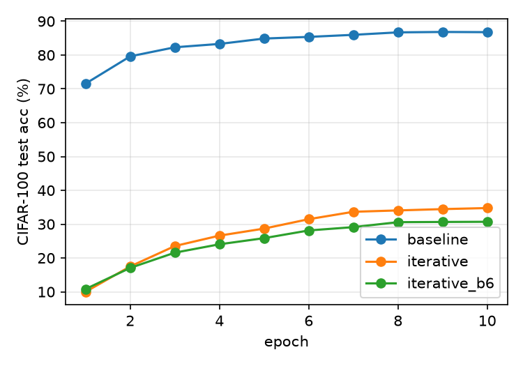

# Iterative ViT-Tiny: does reusing one transformer block work?

First test of the "iterative transformer" idea, requested by my supervisor. Not a paper: a quick, clean experiment.

**Question.** Take pretrained ViT-Tiny (12 transformer blocks), keep **one** block and apply that same block 12 times. How much accuracy do we lose in exchange for fewer parameters?

**Short answer.** Parameters drop by 88% (5.54 M to 0.65 M) but CIFAR-100 accuracy falls from 86.8% to 34.8% (block 0) or 30.7% (block 6). Compute and speed do not change. Under this recipe, naively sharing one pretrained block does not work.

## Results (CIFAR-100, 10 epochs, seed 0, RTX A4000)

| Model | Params | GFLOPs / img | Throughput (img/s) | Final test acc | Best test acc |
|---|---|---|---|---|---|
| Baseline (12 different blocks) | 5.544 M | 2.51 | 5653 | **86.77%** | 86.83% |
| Iterative, block 0 x 12 | 0.650 M | 2.51 | 5773 | 34.76% | 34.76% |
| Iterative, block 6 x 12 | 0.650 M | 2.51 | 5820 | 30.70% | 30.70% |



Per-epoch test accuracy (%):

| Epoch | 1 | 2 | 3 | 4 | 5 | 6 | 7 | 8 | 9 | 10 |
|---|---|---|---|---|---|---|---|---|---|---|
| Baseline | 71.5 | 79.6 | 82.3 | 83.3 | 84.9 | 85.4 | 86.0 | 86.7 | 86.8 | 86.8 |
| Block 0 x 12 | 10.0 | 17.5 | 23.5 | 26.6 | 28.7 | 31.5 | 33.7 | 34.1 | 34.5 | 34.8 |
| Block 6 x 12 | 10.8 | 17.1 | 21.6 | 24.1 | 25.9 | 28.1 | 29.1 | 30.6 | 30.6 | 30.7 |

Raw numbers: [docs/results/](docs/results/) (`baseline.json`, `iterative.json`, `iterative_b6.json`, `summary.md`).

## What the results mean

- **Size vs accuracy.** One shared block holds 444,864 parameters instead of 12 x 444,864. The model shrinks to 0.65 M (embeddings, norm and the 100-class head are the rest).
- **No compute saving.** FLOPs are identical, because the block still runs 12 times. Throughput differences (about 2%) are noise. Sharing saves memory and storage, not time.
- **Block choice did not rescue it.** I expected a middle block (6) to beat block 0, since block 0 does low-level patch mixing. It did worse (30.7% vs 34.8%). One seed and 10 epochs cannot rank the two blocks, but neither is close to the baseline.
- **Not converged.** Both iterative models were still rising slowly at epoch 10. The recipe (lr 1e-4) was set for fine-tuning a normal network, so it may be wrong for a shared block that must be re-learned.

## Setup

- **Models.** `timm` `vit_tiny_patch16_224`, pretrained, new 100-class head. Iterative variant: `model.blocks = nn.Sequential(*[block] * 12)`, so the 12 slots are the same Python object and `.parameters()` counts it once ([src/models.py](src/models.py)).
- **Data.** `timm.data.create_dataset('torch/cifar100')`, resized to 224, transforms and normalization from the model's pretrained config ([src/data.py](src/data.py)).
- **Recipe (identical for all runs).** AdamW, lr 1e-4, weight decay 0.05, 1 warmup epoch then cosine decay, label smoothing 0.1, batch 128, 10 epochs, seed 0, mixed precision on GPU ([src/train.py](src/train.py)).
- **Metrics.** Unique parameters, forward GFLOPs per image (`torch.utils.flop_counter`, 1 MAC = 2 FLOPs), inference throughput at batch 256 ([src/metrics.py](src/metrics.py)).
- **Sharing proof.** [tests/test_sharing.py](tests/test_sharing.py): same object id, parameter count drops by exactly 11 x 444,864, gradients reach the one block, output shape is correct.

## Repo layout

```
src/models.py        baseline + iterative builders
src/data.py          CIFAR-100 loaders via timm
src/metrics.py       params, FLOPs, throughput
src/train.py         one script, --model {baseline,iterative} --block-idx N --tag _bN
scripts/inspect_model.py   print blocks and params per block
scripts/compare.py         results table + plot
tests/test_sharing.py      weight-sharing checks
docs/results/              saved results from the server runs
LEARNING_LOG.md            notes and gotchas
```

## Reproduce

Setup (Mac or Linux server):
```
python3 -m venv .venv && source .venv/bin/activate
pip install -r requirements.txt
python -m pytest -q tests
```

Smoke test (CPU is fine, about 1 minute): `python -m src.train --model iterative --epochs 1 --subset 128 --batch-size 32 --num-workers 0 --tag _smoke`

Real runs (GPU server, inside tmux, check `nvidia-smi` first):
```
mkdir -p results
CUDA_VISIBLE_DEVICES=0 python -m src.train --model baseline  2>&1 | tee results/baseline.log
CUDA_VISIBLE_DEVICES=1 python -m src.train --model iterative 2>&1 | tee results/iterative.log
CUDA_VISIBLE_DEVICES=2 python -m src.train --model iterative --block-idx 6 --tag _b6 2>&1 | tee results/iterative_b6.log
python -m scripts.compare
```
Each run takes about 8 minutes on one A4000. A 10-epoch run on an M2 Air CPU would take roughly 3 to 4 hours (estimate from a smoke test, not measured end to end).

## Gotchas learned

- `[block] * 12` shares one object; `copy.deepcopy` would silently make 12 independent blocks. The test guards this.
- Git does not store empty folders, so `results/` is kept with a `.gitkeep`. Result files are gitignored; the copies worth keeping live in `docs/results/`.
- FLOP counts differ between CPU (2.15 G) and GPU (2.51 G) because the attention op is counted differently. Compare models only on the same machine.
- On a private GitHub repo, `git clone` on the server needs a token; passwords are rejected.
- Run long jobs in `tmux`, one session per job, and name them distinctly (a duplicate name attaches to the old session instead of creating a new one).

## Limits and next steps

Limits: one seed, 10 epochs, two blocks tried, no tuning for the iterative models, CIFAR-100 only.

Next:
1. Sweep all 12 block indices with `--block-idx N` (about 30 minutes using four GPUs in parallel).
2. Try a higher learning rate and longer schedule for the shared model.
3. Repeat the best candidate over 2 to 3 seeds.
4. Consider a gentler design than one shared block (for example sharing within groups of blocks, or adding small per-iteration adapters).
